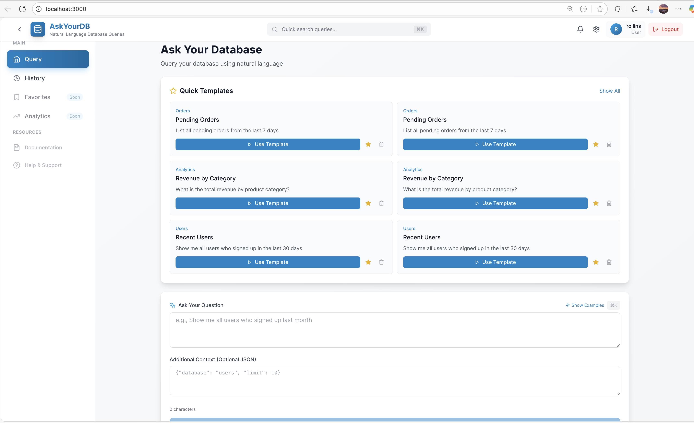
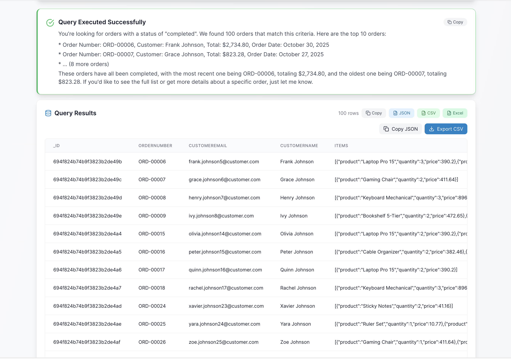
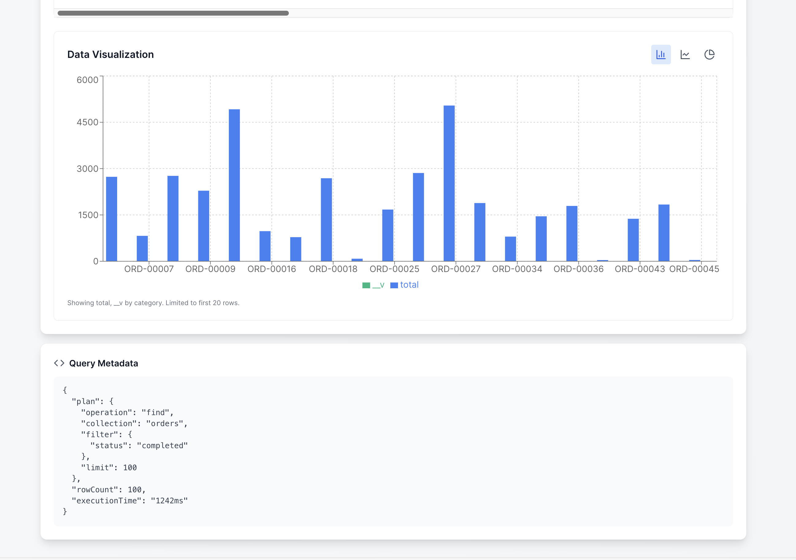
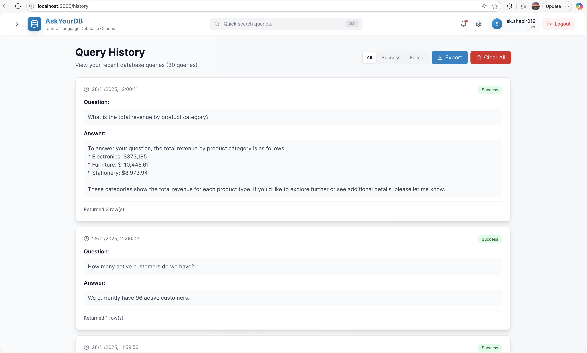
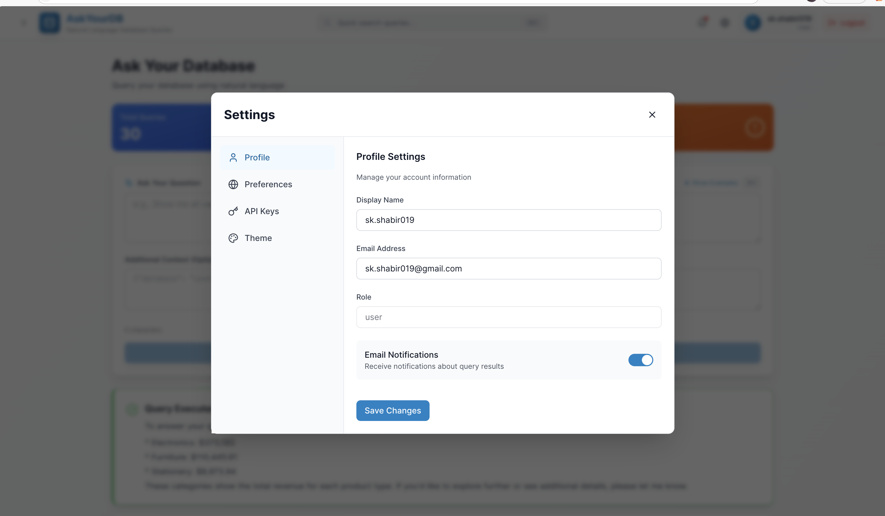

# AskYourDB

Query your database using natural language. Powered by AI (OpenAI/Groq).


## Overview

AskYourDB lets you ask questions about your data in plain English. The AI converts your questions into database queries and returns human-readable answers.

**Example:**
> "How many users signed up in the last 30 days?"
> 
> → "37 users signed up in the last 30 days."

## Screenshots
### Homepage


### Query Interface


### Results Display


### Data Visualization


### Query History


### Settings


## Tech Stack

### Backend
- **Runtime**: Node.js 20+
- **Language**: TypeScript 5.9.3
- **Framework**: Express 4.18.2
- **Database**: MongoDB 7 / PostgreSQL 15
- **AI/LLM**: 
  - OpenAI (gpt-4o-mini)
  - Groq (Llama 3.3-70b)
- **Authentication**: JWT + bcryptjs
- **Validation**: Joi 17.9.2
- **Security**: Helmet, CORS, Rate Limiting, Input Sanitization
- **Logging**: Winston
- **Testing**: Jest 29
- **ORM/Query**: Mongoose (MongoDB), Knex (PostgreSQL)

### Frontend
- **Framework**: React 18.2.0
- **Language**: TypeScript 5.3.3
- **Build Tool**: Vite 5.4.21
- **Styling**: Tailwind CSS 3.3.6
- **State**: Zustand 4.4.7
- **Routing**: React Router DOM 6.20.0
- **HTTP**: Axios 1.6.2
- **Animations**: Framer Motion 10.16.16
- **UI Components**: Lucide React, React Hot Toast

### DevOps
- **Containerization**: Docker (Node 20-Alpine)
- **Orchestration**: Docker Compose
- **Database Clients**: MongoDB 7, PostgreSQL 15-Alpine
- **Nginx**: Reverse proxy & static serving

### Cloud Deployment
- Docker/Docker Compose
- Heroku, AWS (ECS, RDS), DigitalOcean, Vercel, Netlify

## Quick Start

### Option 1: Docker (Recommended) 🐳

```bash
# 1. Clone repository
git clone https://github.com/yourusername/askyourdb.git
cd askyourdb

# 2. Configure environment
cp infra/docker/.env.example infra/docker/.env
nano infra/docker/.env  # Add GROQ_API_KEY, MONGO_PASSWORD, JWT_SECRET

# 3. Start production environment
make prod

# 4. Seed databases with sample data
make seed-prod

# 5. Access application
# Frontend: http://localhost:3000
# Login with any email/password (demo mode)
```

**Production Status**: http://localhost:3000/health

**See [DOCKER_DEPLOYMENT.md](DOCKER_DEPLOYMENT.md) for complete Docker guide.**

### Development Mode

```bash
make dev              # Start dev environment (exposed database ports)
make seed             # Seed dev databases
make logs             # View all logs
make status           # Check service status
```

### Option 2: Manual Setup

#### Prerequisites
- Node.js 18+
- Docker (for database)
- OpenAI or Groq API key

#### 1. Start Database

```bash
# Start MongoDB
docker run -d --name mongo -p 27017:27017 \
  -e MONGO_INITDB_ROOT_USERNAME=admin \
  -e MONGO_INITDB_ROOT_PASSWORD=password123 \
  mongo:7
```

#### 2. Setup Backend

```bash
cd backend
npm install
cp .env.example .env
# Edit .env with your API keys
npm run seed        # Seed sample data
npm run dev         # Start on http://localhost:4000
```

#### 3. Setup Frontend

```bash
cd frontend
npm install
npm run dev         # Start on http://localhost:3001
```

#### 4. Use the App

1. Open http://localhost:3001
2. Register/Login
3. Ask questions like:
   - "Show me all active customers"
   - "What's the total revenue from last month?"
   - "Top 5 products by sales"

## Configuration

Key environment variables in `infra/docker/.env`:

```env
# LLM Provider (openai or groq)
LLM_PROVIDER=groq
OPENAI_API_KEY=sk-...
GROQ_API_KEY=gsk_...

# Database
MONGO_PASSWORD=password123
POSTGRES_PASSWORD=password

# Security
JWT_SECRET=your-secret-key-here
```

### Updating Configuration

**For .env changes (API keys, passwords):**
```bash
nano infra/docker/.env      # Edit variables
make restart                # Restart containers
```

**For backend code changes:**
```bash
# Edit code in backend/src/
cd infra/docker
docker-compose -f docker-compose.prod.yml build backend
docker-compose -f docker-compose.prod.yml up -d backend
```

**For frontend code changes:**
```bash
# Edit code in frontend/src/
cd infra/docker
docker-compose -f docker-compose.prod.yml build frontend
docker-compose -f docker-compose.prod.yml up -d frontend
```

**Full rebuild (code + dependencies changed):**
```bash
make prod-down
cd infra/docker
docker-compose -f docker-compose.prod.yml build
cd ../..
make prod
```

## Project Structure

```
AskYourDB/
├── backend/          # Express API server
├── frontend/         # React SPA
├── infra/            # Docker configs
└── README.md
```

## Documentation

- [Backend README](./backend/README.md) - API details, endpoints, architecture
- [Frontend README](./frontend/README.md) - Components, state management
- [Docker Quick Start](./infra/docker/README.md) - Docker setup guide
- [Error Handling](./backend/ERROR_HANDLING.md) - Error handling patterns

## Docker Management Commands

All commands run from project root:

```bash
# Production
make prod             # Start production environment
make prod-down        # Stop production
make seed-prod        # Seed databases with sample data
make logs-prod        # View production logs

# Development
make dev              # Start dev environment (exposed ports)
make dev-down         # Stop dev
make seed             # Seed dev databases

# Management
make status           # Check service status
make health           # Test health endpoints
make logs             # View all logs
make restart          # Restart all services
make clean            # Remove containers & volumes
make backup-prod      # Backup MongoDB data

# Individual services
make logs-backend     # Backend logs only
make logs-frontend    # Frontend logs only
```

## Sample Queries

Try these natural language queries:

| Query | Description |
|-------|-------------|
| "How many users signed up this month?" | Count with date filter |
| "Show top 10 products by sales" | Sorting and limiting |
| "Total revenue from completed orders" | Aggregation |
| "Active customers who spent over $1000" | Multiple filters |
| "Average order value by status" | Group by with aggregation |

## Switching Databases

### Use PostgreSQL instead of MongoDB:

1. Start PostgreSQL:
```bash
docker run -d --name postgres -p 5432:5432 \
  -e POSTGRES_USER=postgres \
  -e POSTGRES_PASSWORD=postgres \
  -e POSTGRES_DB=askyourdb \
  postgres:15-alpine
```

2. Update `backend/.env`:
```env
DB_ENGINE=postgres
```

3. Seed PostgreSQL:
```bash
npm run seed:postgres
```

## Troubleshooting

### Docker Issues

| Problem | Solution |
|---------|----------|
| Port already in use | `make prod-down` then check if other services use port 3000 |
| Backend 404 errors | Backend has old code - rebuild: `cd infra/docker && docker-compose -f docker-compose.prod.yml build backend` |
| .env changes not applied | Restart containers: `make restart` |
| TypeScript build errors | Fixed in latest code with `// @ts-nocheck` in pgAdapter.ts |

### Application Issues

| Problem | Solution |
|---------|----------|
| MongoDB connection fails | Check MONGO_PASSWORD in `infra/docker/.env` |
| LLM errors | Verify API key is valid and has credits |
| Auth issues | Login accepts any email/password in demo mode |
| "Not Found" on API calls | Ensure backend container rebuilt with latest code |

### Useful Commands

```bash
make status           # Check all services
make logs             # View all logs
make logs-backend     # Backend logs only
make health           # Test health endpoints
docker ps             # See running containers
make clean            # Remove all containers & volumes
```

## Contributing

1. Fork the repository
2. Create a feature branch: `git checkout -b feature/my-feature`
3. Commit changes: `git commit -m 'Add my feature'`
4. Push to branch: `git push origin feature/my-feature`
5. Open a Pull Request

## License

MITMIT
